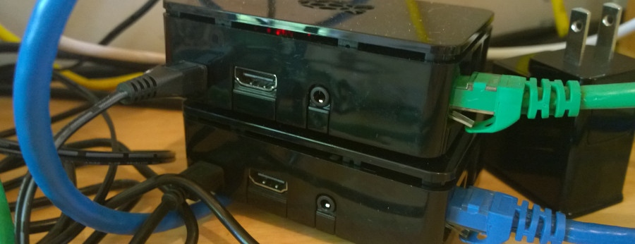
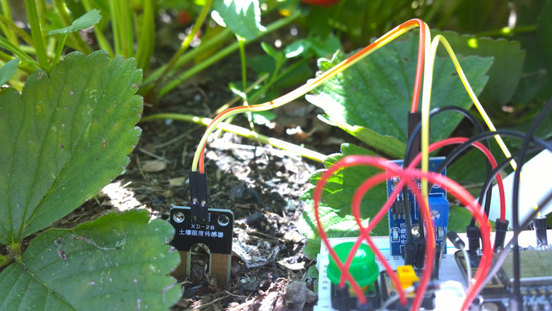

{ title = "IoT Sensor Relay",
  subtitle = "Monitoring the Real World",
  author = {
    name = "Tim Caswell",
    email = "tim@creationix.com",
    twitter = "creationix",
    github = "creationix"
  },
  tags = { "iot", "rackspace", "monitor", "sensor" },
}

As some of you know, I Joined Rackspace's monitoring team about 10 months ago.  They have been very gracious to let me spend large amounts of my work time building and maintaining Luvit. (Luvit is used in production by the monitoring agent.)

Recently I decided to try and find a way to incorporate this free monitoring service with my garden sensor project. I'm happy to report is actually works really well.  The key is to deploy a simple relay server somewhere on the lan. I'm using a Raspberry PI in my home office.



IoT sensors tend to be very low powered devices.  I've had most success recently with the [Particle](https://www.particle.io/) boards and the [Esp8266](http://www.esp8266.com/) chips.  The ESP chips are cheaper, but a little rougher on the edges.  Both of these feature 32-bit microcontrollers with WIFI capability built-in.

## Recording Sensor Data

Since I wish to eventually deploy several of these throughout my yard and run them on batteries, power use is a huge concern.  They can run as TCP servers or clients, but to be in an always listening state is a recipe for power drain.  It's better to deep-sleep most the time and wake up on some interval, measure the environment, and report the data to some other machine.



The monitoring agent typically sits inside VMs hosted by Rackspace and polls the system for things like CPU usage, load average, free disk space, memory pressure, etc.  Users of the monitoring service configure the agents via the monitoring service and tell them what and when to poll for data.

There is also a custom plugin interface that lets you poll for data not found in the pre-programmed set of host info.  Basically you just spawn any subprocess (bash, ruby, node, whatever) and have it output metrics data in a simple text format.  Your process will be called on a user defined schedule.


So we now have a mismatch problem.  The sensor node can't be listening all the time and the agent can't be listening for new events either.  We need some relay in the middle that accepts data from the sensor, buffers it internally, and then dumps it out to the subprocess on demand.

It turns out that luvit is the perfectly fit for the task.  First we need to create a TCP server that listens for sensor reports from the field.

```lua
local createServer = require('coro-net').createServer

-- Listen for IPv4 connections on port 11000
local logs = {}
createServer({ host = "0.0.0.0", port = 11000 }, function (read, write, socket)

  -- Parse input into newline-delimited messages
  local buffer = ""
  for data in read do
    buffer = buffer .. data
    while true do
      -- Look for complete lines
      local line = buffer:match("^[^\n]*\n")
      -- Wait for more data if not.
      if not line then break end
      -- Move line from buffer to log list.
      buffer = buffer:sub(#line + 1)
      logs[#logs + 1] = line
    end
  end
  return write()

end)
```

Ok, now our sensors simply need to connect, write metrics to the socket and close.


We'll forward the data to the agent when it connects.  The core logic of my sensor client consist of:

```c
int light = analogRead(A0);
String data = String("metric light_rainbowdash int ") + String(light, DEC) + "\n";
Serial.print(data);
```

Which brings up a great question, what interface should we expose to the agent?  At first I thought to use another TCP service, but we're on the local machine and we know it's linux.  Let's use a unix socket!  Then the agent plugin can be very simple.

```sh
#!/bin/sh
socat - UNIX:/var/run/gardener
```
